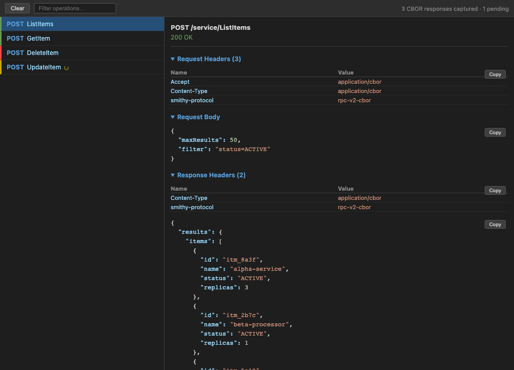

# CBOR Inspector

DevTools extension that auto-decodes Smithy RPC v2 CBOR (`application/cbor`) responses. Works in both Firefox and Chrome.

## Features

- Adds a **CBOR** tab to DevTools
- Auto-captures requests with CBOR content-type as they happen
- Decodes and displays response bodies as syntax-highlighted JSON
- Collapsible request/response headers and request body
- Copy-to-clipboard buttons on decoded JSON
- Handles indefinite-length maps/arrays (Smithy RPC v2 style)
- Zero dependencies — self-contained CBOR decoder

## Installation

### Firefox

Install the latest signed extension from [GitHub Releases](https://github.com/jaredcnance/cbor-inspector/releases/latest). Download the `.xpi` file and Firefox will prompt you to install it. Updates are delivered automatically.

### Chrome

Chrome installation currently requires loading the extension manually in developer mode (see Development section below).

## Usage

1. Open DevTools (F12)
2. Click the **CBOR** tab
3. Make requests — any response with `content-type: application/cbor` is automatically captured
4. Click an entry in the left pane to view decoded JSON and headers

## Development

Setup, local installation, testing, and publishing are documented in [DEVELOPMENT.md](DEVELOPMENT.md).

## License

MIT
